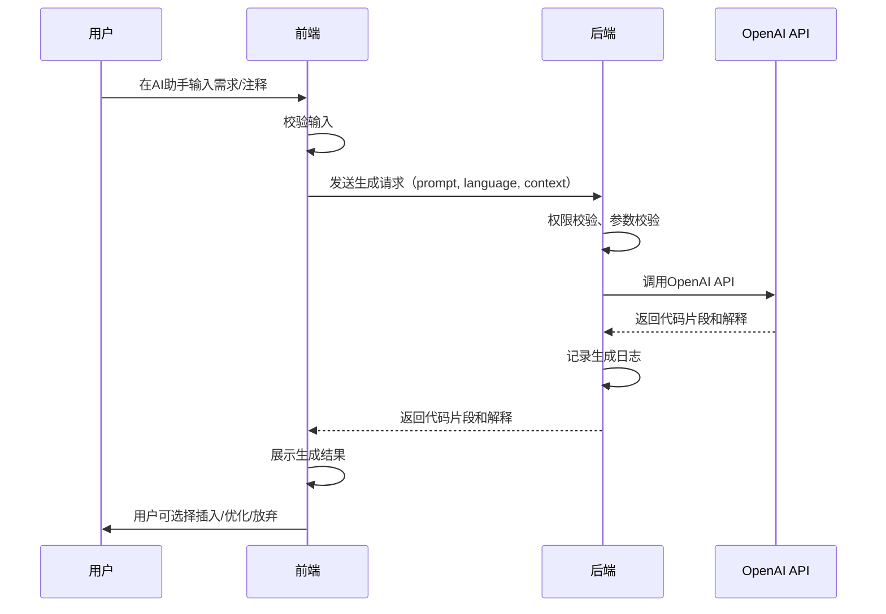
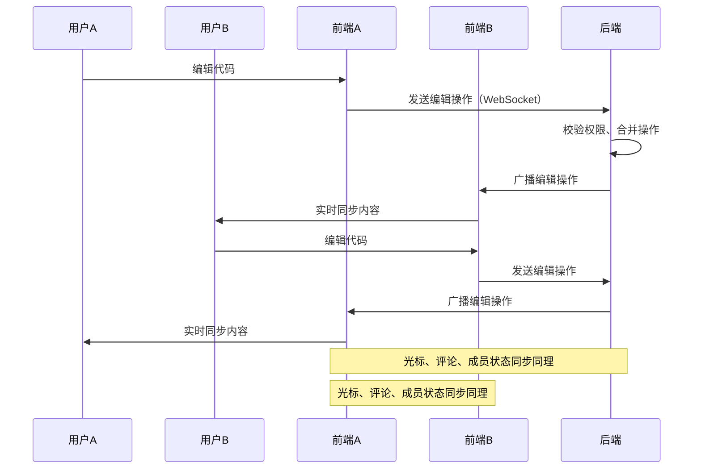
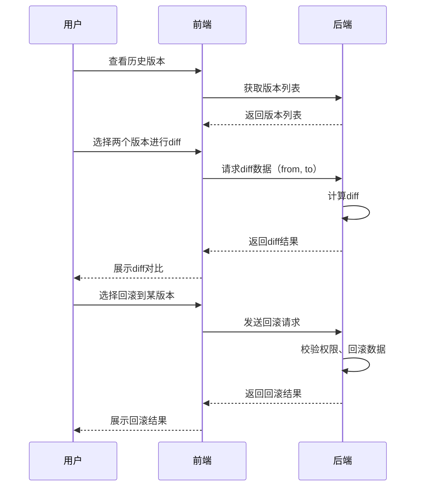

# AI智能代码生成与协作平台 产品需求文档（最终版）

## 一、产品背景

随着AI技术的发展，智能代码生成和多人协作编程成为提升开发效率的重要手段。当前市场缺乏一款集成AI代码生成、实时协作、代码智能分析与质量评估于一体的开发平台。本产品旨在为开发者提供高效、智能、协作的编程体验。

---

## 二、产品目标

- 提升开发效率，降低开发门槛
- 支持多人实时协作编程
- 提供智能代码生成与质量评估
- 实现代码版本管理与变更追踪

---

## 三、用户需求

1. **高效开发**：用户希望通过AI辅助快速生成高质量代码片段，减少重复性劳动。
2. **实时协作**：团队成员可同时在线编辑同一份代码，实时同步变更，提升协作效率。
3. **代码质量保障**：希望平台能自动分析和评估代码质量，给出优化建议。
4. **版本管理**：需要对代码的历史版本进行管理，支持diff对比和回滚。
5. **易用性**：界面友好，操作简单，降低学习成本。

---

## 四、业务需求

1. 支持AI根据注释/需求生成代码片段
2. 支持多人实时协作编辑同一代码文件
3. 支持代码智能分析与质量评分
4. 支持代码版本管理与diff对比
5. 支持主流编程语言（如JavaScript、Python等）
6. 支持用户权限管理（如只读、可编辑等）

---

## 五、功能描述

### 1. AI代码生成

- 用户输入注释或需求描述，AI自动生成对应代码片段
- 支持多种主流编程语言
- 支持对生成代码的进一步编辑和优化建议

### 2. 实时协作编辑器

- 多人可同时编辑同一代码文件，实时同步内容
- 支持光标位置、选区、编辑历史的实时同步
- 支持代码高亮、自动补全、语法检查

### 3. 代码智能分析

- 自动分析代码质量，给出评分和优化建议
- 检查常见代码问题（如语法错误、潜在bug等）

### 4. 版本管理与diff

- 自动保存代码历史版本
- 支持版本对比（diff）、回滚
- 支持版本标签与备注

### 5. 用户与权限管理

- 支持用户注册、登录
- 支持项目成员管理与权限分配（如只读、可编辑、管理员）

---

## 六、交互设计

### 1. 主要界面结构

- **首页**：项目列表、创建新项目入口
- **项目详情页**：文件列表、协作编辑器、AI生成入口、版本管理面板
- **协作编辑器**：代码区、AI助手侧边栏、协作者列表、聊天/评论区
- **版本管理页**：历史版本列表、diff对比、回滚按钮

### 2. 详细交互原型

#### （1）首页

```
+------------------------------------------------------+
| [Logo]  AI智能代码生成与协作平台         [用户头像] |
+------------------------------------------------------+
| [创建新项目]                                        |
+------------------------------------------------------+
| 项目名称   | 成员 | 最后更新时间 | 操作（进入/删除） |
|------------------------------------------------------|
| 项目A     | 3    | 2024-06-01   | [进入] [删除]      |
| 项目B     | 5    | 2024-06-02   | [进入] [删除]      |
+------------------------------------------------------+
```

#### （2）项目详情页

```
+-------------------+-----------------------------------------------+
| 文件列表          | 协作编辑器                                    |
|-------------------|-----------------------------------------------|
| - src/            | +-------------------------------------------+ |
|   - index.js      | | function foo() { ... }                    | |
|   - utils.js      | |                                           | |
| - README.md       | | ...                                       | |
|-------------------| +-------------------------------------------+ |
| [新建文件]        | [AI助手] [版本管理] [协作者] [评论/聊天]     |
+-------------------+-----------------------------------------------+
```

#### （3）AI助手侧边栏

```
+-----------------------------+
| [输入需求/注释]             |
| --------------------------  |
| | 请输入您的需求...      |  |
| --------------------------  |
| [生成代码]                  |
|                             |
| [生成结果展示区]            |
+-----------------------------+
```

#### （4）版本管理面板

```
+-------------------------------+
| 版本号 | 时间       | 操作     |
|--------|------------|----------|
| v1.2   | 2024-06-02 | [对比]   |
| v1.1   | 2024-06-01 | [对比]   |
| v1.0   | 2024-05-31 | [回滚]   |
+-------------------------------+
| [diff对比结果展示区]          |
+-------------------------------+
```

#### （5）协作编辑器实时交互

- 多人同时编辑时，显示不同颜色的光标和选区
- 编辑区右上角显示当前在线协作者头像
- 支持实时评论，评论内容与代码行关联
- 编辑操作自动同步，无需手动保存

#### （6）AI代码生成流程

1. 用户在AI助手侧边栏输入需求/注释
2. 点击"生成代码"按钮
3. AI返回代码片段，用户可选择"插入编辑区"或"继续优化"
4. 生成代码自动高亮显示，支持一键插入

#### （7）版本管理与diff

1. 每次保存自动生成新版本
2. 用户可在版本管理面板选择任意两个版本进行diff对比
3. 支持一键回滚到任意历史版本

#### （8）权限与成员管理

- 项目拥有者可邀请成员，分配权限（只读/可编辑/管理员）
- 成员列表支持移除、权限变更

---

## 七、技术架构

- 前端：Next.js + Monaco Editor
- AI集成：OpenAI API
- 后端：NestJS
- 实时通信：Socket.io
- 数据库：MongoDB / PostgreSQL（可选）

---

## 八、API接口设计（含详细参数、字段类型、校验规则、错误码）

### 错误码通用说明

| 错误码 | 含义                 |
|--------|----------------------|
| 0      | 成功                 |
| 1001   | 参数缺失/格式错误     |
| 1002   | 未授权/Token无效      |
| 1003   | 权限不足             |
| 1004   | 资源不存在/账号不存在 |
| 1005   | 操作冲突/状态异常     |
| 1006   | 服务器内部错误        |

所有接口响应均包含：

- `code` (number)：错误码，0为成功，非0为失败
- `message` (string)：错误或成功提示

---

### 0. 认证相关接口

#### 1. 注册

`POST /api/auth/register`

- **请求参数**

  | 字段      | 类型    | 必填 | 校验规则           |
  |-----------|---------|------|--------------------|
  | email     | string  | 是   | 邮箱格式，唯一      |
  | password  | string  | 是   | 6-32字符           |
  | username  | string  | 是   | 3-20字符，字母数字  |
  | phone     | string  | 否   | 手机号格式         |

- **响应参数**

  | 字段      | 类型    | 说明     |
  |-----------|---------|----------|
  | code      | number  | 错误码   |
  | message   | string  | 提示信息 |
  | userId    | uuid    | 用户ID   |
  | token     | string  | access token |

- **错误响应示例**

```json
{ "code": 1001, "message": "邮箱已被注册" }
```

#### 2. 登录

`POST /api/auth/login`

- **请求参数**

  | 字段      | 类型    | 必填 | 校验规则           |
  |-----------|---------|------|--------------------|
  | email     | string  | 是   | 邮箱格式           |
  | password  | string  | 是   | 6-32字符           |
  | remember  | boolean | 否   | 记住我（默认false）|

- **响应参数**

  | 字段      | 类型    | 说明     |
  |-----------|---------|----------|
  | code      | number  | 错误码   |
  | message   | string  | 提示信息 |
  | token     | string  | access token |
  | userId    | uuid    | 用户ID   |
  | role      | string  | 用户角色 |

- **安全说明**：如remember为true，refresh token写入httpOnly cookie。

- **错误响应示例**

```json
{ "code": 1004, "message": "邮箱或密码错误" }
```

#### 3. 忘记密码（邮箱找回）

`POST /api/auth/forgot-password`

- **请求参数**

  | 字段      | 类型    | 必填 | 校验规则           |
  |-----------|---------|------|--------------------|
  | email     | string  | 是   | 邮箱格式           |

- **响应参数**

  | 字段      | 类型    | 说明     |
  |-----------|---------|----------|
  | code      | number  | 错误码   |
  | message   | string  | 提示信息 |

- **错误响应示例**

```json
{ "code": 1004, "message": "邮箱未注册" }
```

`POST /api/auth/reset-password`

- **请求参数**

  | 字段      | 类型    | 必填 | 校验规则           |
  |-----------|---------|------|--------------------|
  | token     | string  | 是   | 邮件中的重置token  |
  | password  | string  | 是   | 6-32字符           |

- **响应参数**

  | 字段      | 类型    | 说明     |
  |-----------|---------|----------|
  | code      | number  | 错误码   |
  | message   | string  | 提示信息 |

- **错误响应示例**

```json
{ "code": 1001, "message": "重置链接已失效" }
```

#### 4. 自动登录/刷新token

`POST /api/auth/refresh`

- **请求参数**：无（refresh token在httpOnly cookie中）
- **响应参数**

  | 字段      | 类型    | 说明     |
  |-----------|---------|----------|
  | code      | number  | 错误码   |
  | message   | string  | 提示信息 |
  | token     | string  | 新的access token |

- **错误响应示例**

```json
{ "code": 1002, "message": "登录已过期，请重新登录" }
```

---

### 1. 用户与权限相关

#### `GET /api/user/profile` 获取用户信息

- **请求参数**
  - Header: `Authorization: Bearer <token>`
- **响应参数**

  | 字段      | 类型    | 说明     |
  |-----------|---------|----------|
  | code      | number  | 错误码   |
  | message   | string  | 提示信息 |
  | userId    | uuid    | 用户ID   |
  | username  | string  | 用户名   |
  | email     | string  | 邮箱     |
  | roles     | array   | 角色列表 |

- **错误响应示例**

```json
{
  "code": 1002,
  "message": "未授权或Token无效"
}
```

#### `POST /api/project/:id/invite` 邀请成员

- **请求参数**

  | 字段      | 类型    | 必填 | 校验规则           |
  |-----------|---------|------|--------------------|
  | email     | string  | 是   | 邮箱格式           |
  | role      | string  | 是   | viewer/editor/admin|

- **响应参数**

  | 字段      | 类型    | 说明     |
  |-----------|---------|----------|
  | code      | number  | 错误码   |
  | message   | string  | 提示信息 |
  | success   | boolean | 是否成功 |

- **错误响应示例**

```json
{
  "code": 1003,
  "message": "权限不足"
}
```

#### `POST /api/project/:id/role` 变更成员权限

- **请求参数**

  | 字段      | 类型    | 必填 | 校验规则           |
  |-----------|---------|------|--------------------|
  | userId    | uuid    | 是   |                    |
  | role      | string  | 是   | viewer/editor/admin|

- **响应参数** 同上

---

### 2. 项目与文件管理

#### `POST /api/project` 创建项目

- **请求参数**

  | 字段        | 类型    | 必填 | 校验规则           |
  |-------------|---------|------|--------------------|
  | name        | string  | 是   | 3-30字符           |
  | description | string  | 否   | 最多200字符        |

- **响应参数**

  | 字段        | 类型    | 说明     |
  |-------------|---------|----------|
  | code        | number  | 错误码   |
  | message     | string  | 提示信息 |
  | projectId   | uuid    | 项目ID   |
  | name        | string  | 项目名   |
  | description | string  | 描述     |

- **错误响应示例**

```json
{
  "code": 1001,
  "message": "项目名称不能为空"
}
```

#### `GET /api/project` 获取项目列表

- **请求参数**
  - Header: `Authorization: Bearer <token>`
- **响应参数**

  | 字段      | 类型    | 说明     |
  |-----------|---------|----------|
  | code      | number  | 错误码   |
  | message   | string  | 提示信息 |
  | projects  | array   | 项目列表 |

  - projectId (uuid)
  - name (string)
  - lastUpdated (string)
  - members (array)
- **错误响应示例**

```json
{
  "code": 1002,
  "message": "未授权"
}
```

#### `GET /api/project/:id` 获取项目详情

- **响应参数**

  | 字段      | 类型    | 说明     |
  |-----------|---------|----------|
  | code      | number  | 错误码   |
  | message   | string  | 提示信息 |
  | projectId | uuid    | 项目ID   |
  | name      | string  | 项目名   |
  | description | string| 描述     |
  | files     | array   | 文件列表 |

- **错误响应示例**

```json
{
  "code": 1004,
  "message": "项目不存在"
}
```

#### `DELETE /api/project/:id` 删除项目

- **响应参数**

  | 字段      | 类型    | 说明     |
  |-----------|---------|----------|
  | code      | number  | 错误码   |
  | message   | string  | 提示信息 |
  | success   | boolean | 是否成功 |

- **错误响应示例**

```json
{
  "code": 1003,
  "message": "权限不足"
}
```

#### `POST /api/project/:id/file` 新建文件

- **请求参数**

  | 字段      | 类型    | 必填 | 校验规则           |
  |-----------|---------|------|--------------------|
  | filename  | string  | 是   | 1-50字符           |
  | content   | string  | 否   |                    |

- **响应参数**

  | 字段      | 类型    | 说明     |
  |-----------|---------|----------|
  | code      | number  | 错误码   |
  | message   | string  | 提示信息 |
  | fileId    | uuid    | 文件ID   |
  | filename  | string  | 文件名   |

- **错误响应示例**

```json
{
  "code": 1005,
  "message": "文件已存在"
}
```

#### `GET /api/project/:id/file/:fileId` 获取文件内容

- **响应参数**

  | 字段      | 类型    | 说明     |
  |-----------|---------|----------|
  | code      | number  | 错误码   |
  | message   | string  | 提示信息 |
  | fileId    | uuid    | 文件ID   |
  | filename  | string  | 文件名   |
  | content   | string  | 文件内容 |
  | versions  | array   | 版本列表 |

- **错误响应示例**

```json
{
  "code": 1004,
  "message": "文件不存在"
}
```

#### `PUT /api/project/:id/file/:fileId` 更新文件内容

- **请求参数**

  | 字段      | 类型    | 必填 | 校验规则           |
  |-----------|---------|------|--------------------|
  | content   | string  | 是   |                    |

- **响应参数**

  | 字段      | 类型    | 说明     |
  |-----------|---------|----------|
  | code      | number  | 错误码   |
  | message   | string  | 提示信息 |
  | success   | boolean | 是否成功 |
  | versionId | uuid    | 版本ID   |

- **错误响应示例**

```json
{
  "code": 1006,
  "message": "服务器内部错误"
}
```

#### `DELETE /api/project/:id/file/:fileId` 删除文件

- **响应参数** 同上

---

### 3. AI代码生成与分析

#### `POST /api/ai/generate` 代码生成

- **请求参数**

  | 字段      | 类型    | 必填 | 校验规则           |
  |-----------|---------|------|--------------------|
  | prompt    | string  | 是   | 1-200字符          |
  | language  | string  | 是   | 支持的语言列表     |
  | context   | string  | 否   |                    |

- **响应参数**

  | 字段        | 类型    | 说明     |
  |-------------|---------|----------|
  | code        | number  | 错误码   |
  | message     | string  | 提示信息 |
  | code        | string  | 代码片段 |
  | explanation | string  | 代码解释 |

- **错误响应示例**

```json
{
  "code": 1001,
  "message": "缺少必要参数"
}
```

#### `POST /api/ai/optimize` 代码优化建议

- **请求参数**

  | 字段      | 类型    | 必填 | 校验规则           |
  |-----------|---------|------|--------------------|
  | code      | string  | 是   |                    |
  | language  | string  | 是   | 支持的语言列表     |

- **响应参数**

  | 字段        | 类型    | 说明     |
  |-------------|---------|----------|
  | code        | number  | 错误码   |
  | message     | string  | 提示信息 |
  | suggestions | array   | 优化建议 |

- **错误响应示例**

```json
{
  "code": 1006,
  "message": "AI服务异常"
}
```

#### `POST /api/ai/analyze` 代码质量分析

- **请求参数** 同上
- **响应参数**

  | 字段      | 类型    | 说明     |
  |-----------|---------|----------|
  | code      | number  | 错误码   |
  | message   | string  | 提示信息 |
  | score     | number  | 质量评分 |
  | issues    | array   | 问题列表 |

- **错误响应示例**

```json
{
  "code": 1001,
  "message": "代码内容不能为空"
}
```

---

### 4. 协作与实时通信

#### `WebSocket /ws/project/:id` 实时协作通道

- **消息类型与字段**
  - `edit`：
    - userId (uuid, 必填)
    - fileId (uuid, 必填)
    - range (object, 必填)
    - text (string, 必填)
  - `cursor`：
    - userId (uuid, 必填)
    - fileId (uuid, 必填)
    - position (object, 必填)
  - `comment`：
    - userId (uuid, 必填)
    - fileId (uuid, 必填)
    - line (number, 必填)
    - content (string, 必填)
  - `status`：
    - userId (uuid, 必填)
    - online (boolean, 必填)
- **错误响应**

```json
{
  "code": 1002,
  "message": "未授权"
}
```

---

### 5. 版本管理

#### `GET /api/project/:id/file/:fileId/versions` 获取文件历史版本

- **响应参数**

  | 字段      | 类型    | 说明     |
  |-----------|---------|----------|
  | code      | number  | 错误码   |
  | message   | string  | 提示信息 |
  | versions  | array   | 版本列表 |

  - versionId (uuid)
  - timestamp (string)
  - author (string)
- **错误响应示例**

```json
{
  "code": 1004,
  "message": "文件不存在"
}
```

#### `GET /api/project/:id/file/:fileId/diff?from=xxx&to=yyy` 获取diff对比

- **响应参数**

  | 字段      | 类型    | 说明     |
  |-----------|---------|----------|
  | code      | number  | 错误码   |
  | message   | string  | 提示信息 |
  | diff      | string  | diff内容 |

- **错误响应示例**

```json
{
  "code": 1001,
  "message": "参数缺失"
}
```

#### `POST /api/project/:id/file/:fileId/rollback` 回滚到指定版本

- **请求参数**

  | 字段      | 类型    | 必填 | 校验规则           |
  |-----------|---------|------|--------------------|
  | versionId | uuid    | 是   |                    |

- **响应参数**

  | 字段      | 类型    | 说明     |
  |-----------|---------|----------|
  | code      | number  | 错误码   |
  | message   | string  | 提示信息 |
  | success   | boolean | 是否成功 |

- **错误响应示例**

```json
{
  "code": 1003,
  "message": "权限不足"
}
```

---

## 九、主要业务流程图

### 1. AI代码生成超级详细流程



### 2. 多人协作编辑超级详细流程



### 3. 版本管理与diff超级详细流程



---

## 十、非功能性需求

- 高可用性与稳定性
- 数据安全与隐私保护
- 良好的扩展性与可维护性
- 兼容主流浏览器

---

## 十一、里程碑与交付计划

1. 需求评审与原型设计
2. 核心功能开发（AI生成、协作编辑、版本管理）
3. 内测与优化
4. 正式上线

---

如需进一步细化某一部分（如API接口更详细示例、流程图扩展等），请随时告知！

## 十二、详细权限模型

本平台采用简洁的三角色权限体系：只读、编辑、管理员。

| 功能/操作           | 只读（Viewer） | 编辑（Editor） | 管理员（Admin） |
|---------------------|:--------------:|:--------------:|:---------------:|
| 浏览项目/文件       | ✓              | ✓              | ✓               |
| 编辑文件内容        |                | ✓              | ✓               |
| 新建/删除文件       |                | ✓              | ✓               |
| AI代码生成/分析     |                | ✓              | ✓               |
| 版本回滚            |                | ✓              | ✓               |
| 评论/协作           |                | ✓              | ✓               |
| 邀请/移除成员       |                |                | ✓               |
| 变更成员权限        |                |                | ✓               |
| 删除项目            |                |                | ✓               |

- **只读（Viewer）**：仅可浏览项目、文件和历史版本。
- **编辑（Editor）**：可编辑、创建、删除文件，使用AI功能，协作评论，版本回滚。
- **管理员（Admin）**：拥有全部权限，包括成员管理、权限分配、项目删除。

> 建议：三种权限足以覆盖大部分团队协作场景，既简洁又易于管理。

---

## 十三、API安全与限流说明

### 1. 鉴权与安全机制

- **JWT（JSON Web Token）**：所有需要身份认证的API均需在Header中携带`Authorization: Bearer <token>`，后端校验token有效性。
- **HTTPS**：所有API通信均要求HTTPS，防止中间人攻击和数据泄露。
- **权限校验**：后端根据token中的用户身份和角色，校验每个接口的访问权限。
- **敏感操作二次确认**：如删除项目、回滚版本等高风险操作，前端需弹窗确认，后端可要求二次验证（如再次输入密码或验证码，视实际需求可选）。

### 2. 接口限流策略

- **全局限流**：如每个IP每分钟不超过100次请求，防止恶意刷接口。
- **用户级限流**：如每个用户每分钟不超过60次AI生成请求，防止滥用AI资源。
- **AI接口专属限流**：AI相关接口（如`/api/ai/generate`）可单独设置更严格的限流策略。
- **异常检测与封禁**：对频繁触发限流或异常行为的IP/账号，自动临时封禁并告警。

### 3. 其他安全建议

- **CSRF防护**：对Web端敏感操作接口增加CSRF Token校验。
- **输入校验与防注入**：所有输入参数后端严格校验，防止SQL/NoSQL注入、XSS等攻击。
- **操作日志与审计**：关键操作（如权限变更、删除项目）需记录操作日志，便于追溯。

