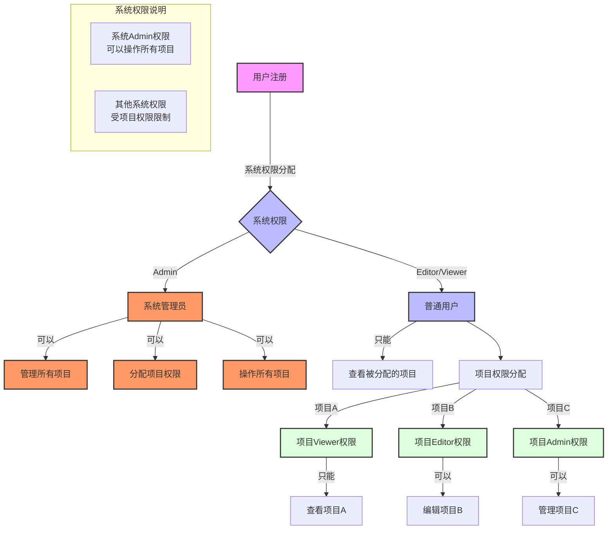
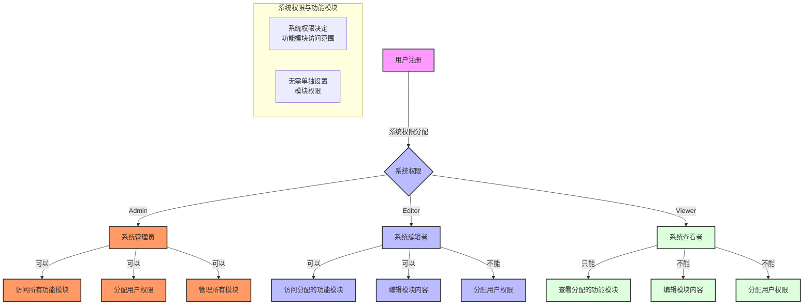

# 系统权限与项目权限说明文档

## 权限体系概述

系统采用二级权限管理体系：

1. 系统权限（用户权限）
2. 项目权限

## 系统权限说明

### 系统管理员（Admin）

- 可以查看和管理所有项目
- 可以分配项目权限
- 可以操作所有项目
- 不受项目权限限制
- 可以访问所有功能模块
- 可以分配用户权限

### 系统编辑者（Editor）

- 只能查看被分配的项目
- 具体操作权限由项目权限决定
- 受项目权限限制
- 可以访问被分配的功能模块，可以编辑内容
- 无法分配用户权限

### 系统查看者（Viewer）

- 只能查看被分配的项目
- 具体操作权限由项目权限决定
- 受项目权限限制
- 只能查看被分配的功能模块，无法编辑
- 无法分配用户权限

## 项目权限说明

### 项目查看者（Viewer）

- 只能查看项目信息
- 无法进行编辑操作
- 无法管理项目成员

### 项目编辑者（Editor）

- 可以查看项目信息
- 可以编辑项目内容
- 可以管理项目文档
- 无法管理项目成员

### 项目管理员（Admin）

- 可以查看项目信息
- 可以编辑项目内容
- 可以管理项目文档
- 可以管理项目成员
- 可以设置项目权限

## 功能模块说明

功能模块不需要单独设计权限，功能模块的访问权限由用户的系统权限直接决定：

- 系统管理员（Admin）：可以访问所有功能模块
- 系统编辑者（Editor）：可以访问被分配的功能模块，可以编辑内容
- 系统查看者（Viewer）：只能查看被分配的功能模块，无法编辑

## 权限关系说明

1. 系统权限决定用户可见的项目范围和功能模块范围
2. 项目权限决定用户对具体项目的操作权限
3. 系统管理员（Admin）权限可以覆盖项目权限限制
4. 其他系统权限（Editor/Viewer）受项目权限限制
5. 功能模块访问权限由系统权限直接决定
6. 只有系统管理员可以分配用户权限

## 权限流程图

### 系统权限与项目权限流程图

### 系统权限与功能模块关系图

## 权限使用示例

### 示例1：系统管理员

- 系统权限：Admin
- 可以查看和管理所有项目
- 不受项目权限限制
- 可以随时介入任何项目
- 可以访问所有功能模块
- 可以分配用户权限

### 示例2：普通用户

- 系统权限：Editor
- 项目A权限：Viewer
  - 只能查看项目A
  - 无法编辑项目A
- 项目B权限：Editor
  - 可以查看项目B
  - 可以编辑项目B
- 项目C权限：Admin
  - 可以查看项目C
  - 可以编辑项目C
  - 可以管理项目C成员
- 功能模块访问：
  - 可以访问被分配的功能模块
  - 可以编辑模块内容
  - 无法访问未分配的模块
  - 无法分配用户权限
