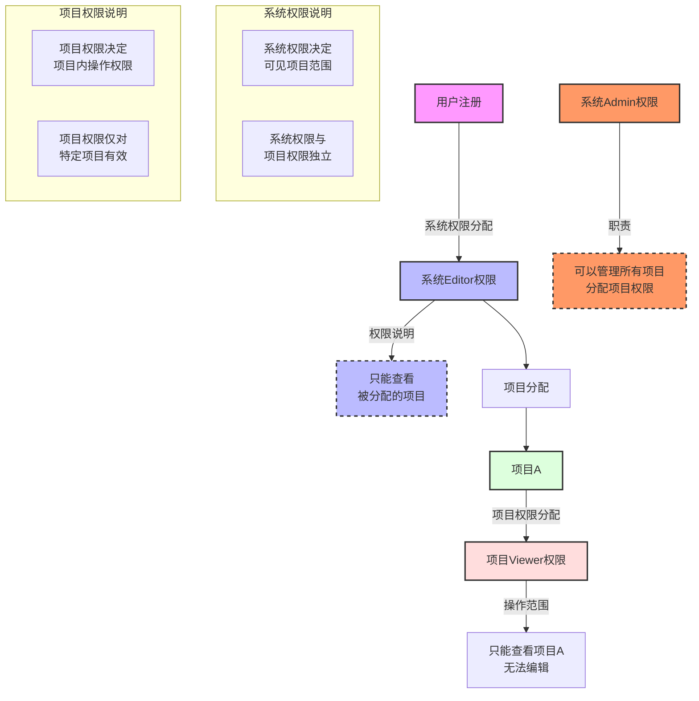

```mermaid
graph TD
    %% 用户权限部分
    A[用户注册] -->|系统权限分配| B[系统Editor权限]

    %% 系统权限说明
    B -->|权限说明| B1[只能查看<br/>被分配的项目]

    %% 项目分配流程
    B --> C[项目分配]
    C --> D[项目A]

    %% 项目权限说明
    D -->|项目权限分配| E[项目Viewer权限]

    %% 项目权限具体操作
    E -->|操作范围| E1[只能查看项目A<br/>无法编辑]

    %% 系统Admin权限说明
    Z[系统Admin权限] -->|职责| Z1[可以管理所有项目<br/>分配项目权限]

    %% 权限关系说明
    classDef note fill:#fff,stroke:#333,stroke-dasharray: 5 5
    class B1,Z1 note

    %% 样式设置
    style A fill:#f9f,stroke:#333,stroke-width:2px
    style B fill:#bbf,stroke:#333,stroke-width:2px
    style B1 fill:#bbf,stroke:#333,stroke-width:2px
    style D fill:#dfd,stroke:#333,stroke-width:2px
    style E fill:#fdd,stroke:#333,stroke-width:2px
    style Z fill:#f96,stroke:#333,stroke-width:2px
    style Z1 fill:#f96,stroke:#333,stroke-width:2px

    %% 权限说明
    subgraph 系统权限说明
        S1[系统权限决定<br/>可见项目范围]
        S2[系统权限与<br/>项目权限独立]
    end

    subgraph 项目权限说明
        P1[项目权限决定<br/>项目内操作权限]
        P2[项目权限仅对<br/>特定项目有效]
    end
```
