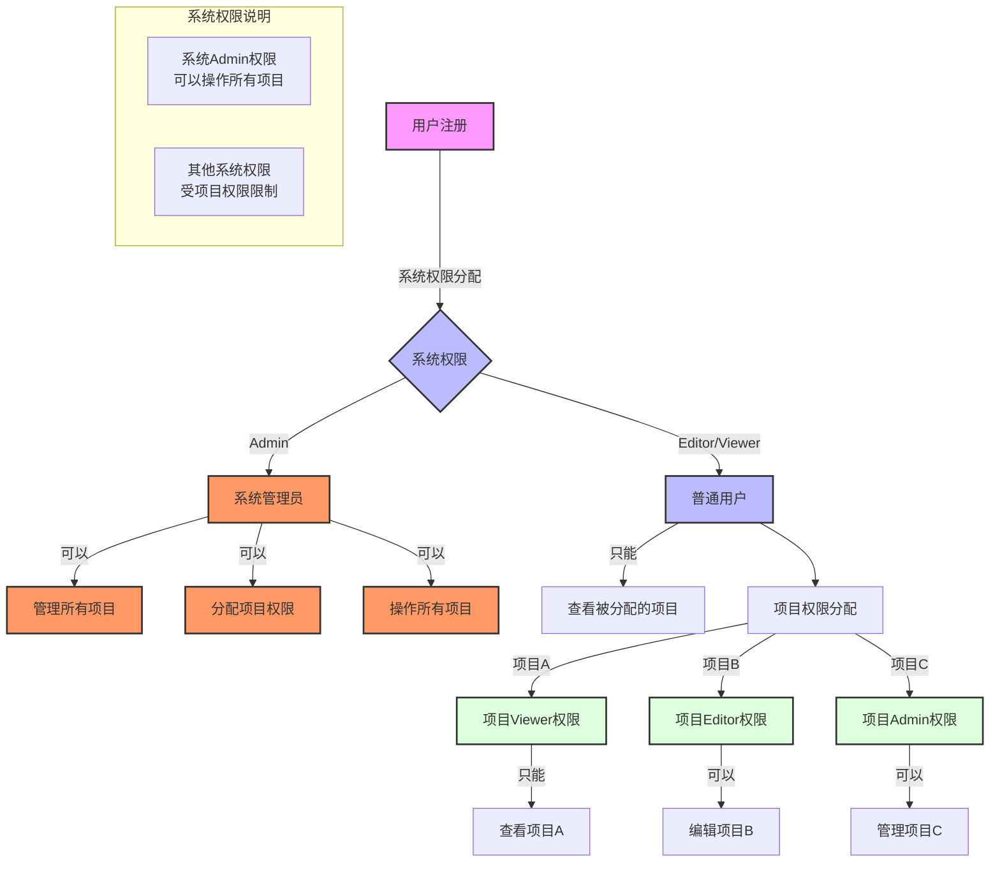

```mermaid
graph TD
    %% 用户权限部分
    A[用户注册] -->|系统权限分配| B{系统权限}
    B -->|Admin| C[系统管理员]
    B -->|Editor/Viewer| D[普通用户]

    %% 系统管理员权限
    C -->|可以| C1[管理所有项目]
    C -->|可以| C2[分配项目权限]
    C -->|可以| C3[操作所有项目]

    %% 普通用户权限
    D -->|只能| D1[查看被分配的项目]
    D --> E[项目权限分配]

    %% 项目权限说明
    E -->|项目A| F[项目Viewer权限]
    E -->|项目B| G[项目Editor权限]
    E -->|项目C| H[项目Admin权限]

    %% 项目权限具体操作
    F -->|只能| F1[查看项目A]
    G -->|可以| G1[编辑项目B]
    H -->|可以| H1[管理项目C]

    %% 样式设置
    style A fill:#f9f,stroke:#333,stroke-width:2px
    style B fill:#bbf,stroke:#333,stroke-width:2px
    style C fill:#f96,stroke:#333,stroke-width:2px
    style D fill:#bbf,stroke:#333,stroke-width:2px
    style C1 fill:#f96,stroke:#333,stroke-width:2px
    style C2 fill:#f96,stroke:#333,stroke-width:2px
    style C3 fill:#f96,stroke:#333,stroke-width:2px
    style F fill:#dfd,stroke:#333,stroke-width:2px
    style G fill:#dfd,stroke:#333,stroke-width:2px
    style H fill:#dfd,stroke:#333,stroke-width:2px

    %% 权限说明
    subgraph 系统权限说明
        S1[系统Admin权限<br/>可以操作所有项目]
        S2[其他系统权限<br/>受项目权限限制]
    end
```
