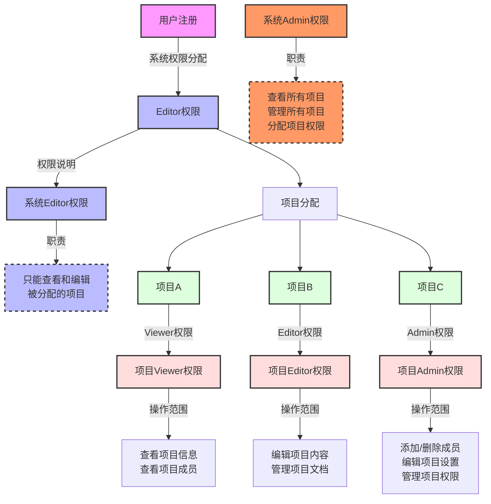

```mermaid
graph TD
    %% 用户权限部分
    A[用户注册] -->|系统权限分配| B[Editor权限]

    %% 用户权限说明
    B -->|权限说明| B1[系统Editor权限]
    B1 -->|职责| B2[只能查看和编辑<br/>被分配的项目]

    %% 项目分配流程
    B --> C[项目分配]
    C --> D[项目A]
    C --> E[项目B]
    C --> F[项目C]

    %% 项目权限说明
    D -->|Viewer权限| G[项目Viewer权限]
    E -->|Editor权限| H[项目Editor权限]
    F -->|Admin权限| I[项目Admin权限]

    %% 项目权限具体操作
    G -->|操作范围| G1[查看项目信息<br/>查看项目成员]
    H -->|操作范围| H1[编辑项目内容<br/>管理项目文档]
    I -->|操作范围| I1[添加/删除成员<br/>编辑项目设置<br/>管理项目权限]

    %% 系统Admin权限说明
    Z[系统Admin权限] -->|职责| Z1[查看所有项目<br/>管理所有项目<br/>分配项目权限]

    %% 样式设置
    style A fill:#f9f,stroke:#333,stroke-width:2px
    style B fill:#bbf,stroke:#333,stroke-width:2px
    style B1 fill:#bbf,stroke:#333,stroke-width:2px
    style B2 fill:#bbf,stroke:#333,stroke-width:2px
    style D fill:#dfd,stroke:#333,stroke-width:2px
    style E fill:#dfd,stroke:#333,stroke-width:2px
    style F fill:#dfd,stroke:#333,stroke-width:2px
    style G fill:#fdd,stroke:#333,stroke-width:2px
    style H fill:#fdd,stroke:#333,stroke-width:2px
    style I fill:#fdd,stroke:#333,stroke-width:2px
    style Z fill:#f96,stroke:#333,stroke-width:2px
    style Z1 fill:#f96,stroke:#333,stroke-width:2px

    %% 权限关系说明
    classDef note fill:#fff,stroke:#333,stroke-dasharray: 5 5
    class B2,Z1 note
```
